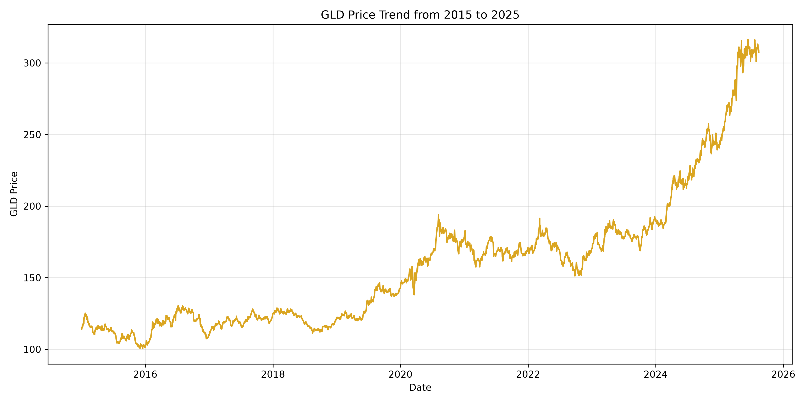
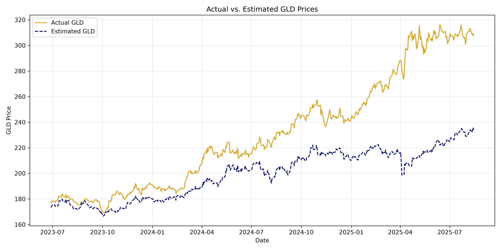

# Gold Market Data Analysis

## Project Overview

This project explores GLD market prices from 2015 to 2025 using Python and Pandas. The analysis includes data inspection, filtering, grouping, visualization, and an introductory linear regression model.

The model examines whether SPX, USO, SLV, and EUR/USD can help explain GLD prices.

## Dataset

The dataset was obtained from Kaggle:

[Gold Price 2015–2025 Dataset](https://www.kaggle.com/datasets/mdanwarhossain200110/gold-price-2015-2025)

The dataset contains the following variables:

- `Date`: Date of the observation
- `SPX`: S&P 500 index level
- `GLD`: SPDR Gold Shares ETF price
- `USO`: United States Oil Fund price
- `SLV`: iShares Silver Trust price
- `EUR/USD`: Euro-to-U.S.-dollar exchange rate

## Tools and Libraries

- Python
- Pandas
- Matplotlib
- Scikit-learn
- Polars

## Analysis Steps

### 1. Data Inspection

The dataset was imported using Pandas. I examined:

- The first five rows
- Dataset dimensions
- Column names and data types
- Summary statistics
- Missing values
- Duplicate rows

The dataset contained no missing values and no duplicate rows.

### 2. Filtering

I calculated the overall average GLD price and filtered the dataset to retain observations where GLD was above this average.

The overall average GLD price was approximately `$158.60`. There were `1,299` trading-day observations where GLD was above the overall average.

### 3. Grouping

The data was grouped by year to calculate:

- Average GLD price
- Minimum GLD price
- Maximum GLD price
- Number of observations

Complete years generally contained approximately 249–253 trading-day observations. The year 2025 contained only 153 observations, indicating that it was a partial year in this dataset.

The annual average GLD price increased from approximately `$111.15` in 2015 to `$288.87` in the available portion of 2025.

### 4. Visualization

A line chart was created to show the GLD price trend from 2015 to 2025.



The chart shows an overall upward trend, with especially strong growth during 2024 and 2025.

### 5. Machine Learning

I used a linear regression model with the following inputs:

- SPX
- USO
- SLV
- EUR/USD

The output variable was GLD.

Because the observations are time ordered, the first 80% of the dataset was used for training and the last 20% was used for testing. The data was not randomly shuffled.

The model produced the following test results:

- Mean Absolute Error: `31.27`
- R-squared: `0.10`

The Mean Absolute Error indicates that the model's GLD estimates differed from the actual GLD values by approximately `$31.27` on average.

The R-squared value indicates that the model explained approximately 10% of the variation in GLD prices during the test period. Therefore, the selected variables had limited explanatory ability in this simple linear model.



## Main Findings

- GLD displayed an overall upward trend between 2015 and 2025.
- GLD prices rose particularly rapidly during 2024 and 2025.
- There were 1,299 observations above the full-period average GLD price.
- The 2025 data represented only part of the year.
- The linear regression model had limited performance on the later test period.
- Relationships between financial-market variables and GLD may be nonlinear or may change over time.

## Limitations

This model uses variables observed on the same trading day, so it estimates or explains contemporaneous GLD prices rather than forecasting future prices.

The analysis also uses price levels, which may contain long-term trends. Additional analysis could examine daily returns, volatility, lagged variables, and nonlinear machine-learning algorithms.

## How to Run the Project

Install the required libraries:

```bash
python -m pip install pandas matplotlib scikit-learn
```

Run the analysis:

```bash
python overview.py
```

## Files

- `overview.py`: Python data analysis script
- `gold_data_2015_25.csv`: Dataset
- `gld_price_trend.png`: GLD time-series visualization
- `actual_vs_estimated_gld.png`: Model comparison visualization
- `README.md`: Project documentation
- `polars_comparison.py`: Pandas and Polars performance comparison

## Rust Ownership Experiment

I completed and modified the provided Rust Jupyter notebook using the
Evcxr Rust kernel.

The exercises included:

- Variables and formatted output
- Conditional statements
- Loops and counting
- Mutable variables using `mut`
- Rust ownership and value movement
- Copying owned data using `.clone()`

One ownership experiment removed `.clone()` from a vector assignment.
This moved ownership of the vector to the new variable, so the original
variable could no longer be used.

Restoring `.clone()` created a separate copy, allowing both variables
to remain valid.

The completed notebook is available in:

`rust_vs_python_intro_modified.ipynb`

## Pandas and Polars Comparison

I used both Pandas and Polars to perform the same operations:

- Read the CSV file
- Convert the date column
- Filter GLD observations above the overall average
- Group GLD prices by year
- Calculate summary statistics

Both implementations identified 1,299 observations where GLD was above
its overall average, confirming that they produced consistent results.

I repeated the operations 100 times. The results were:

- Pandas total time: 0.3972 seconds
- Polars total time: 0.1460 seconds
- Pandas average per run: 0.003972 seconds
- Polars average per run: 0.001460 seconds
- Polars was approximately 2.72 times faster in this test

The dataset contains only 2,666 rows, so this result should be interpreted
cautiously. Performance on a small dataset may be affected by file caching,
startup costs, computer workload, and normal timing variation.