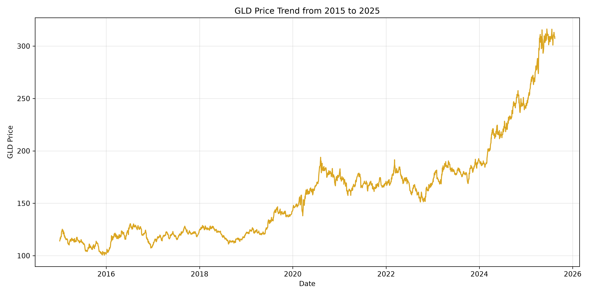
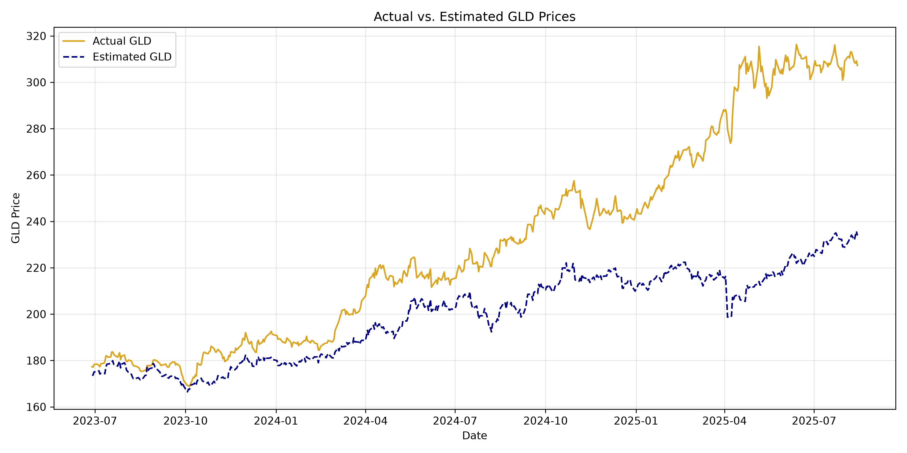
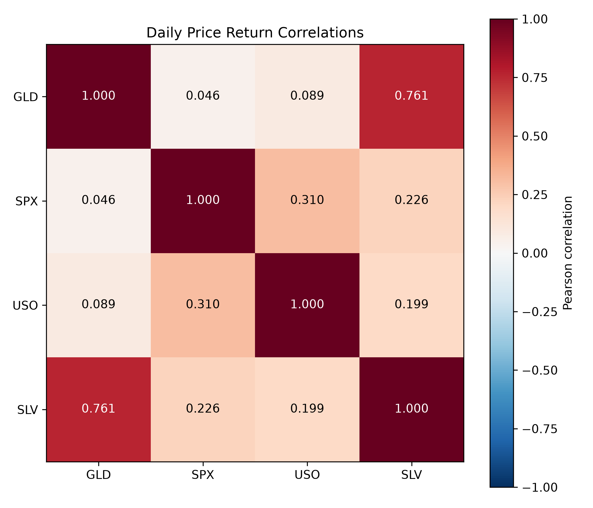
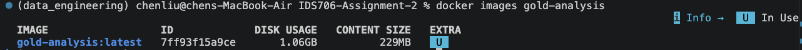
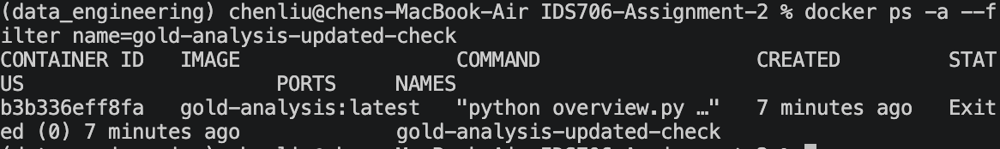
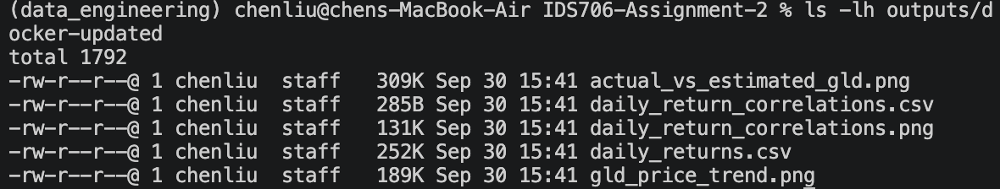
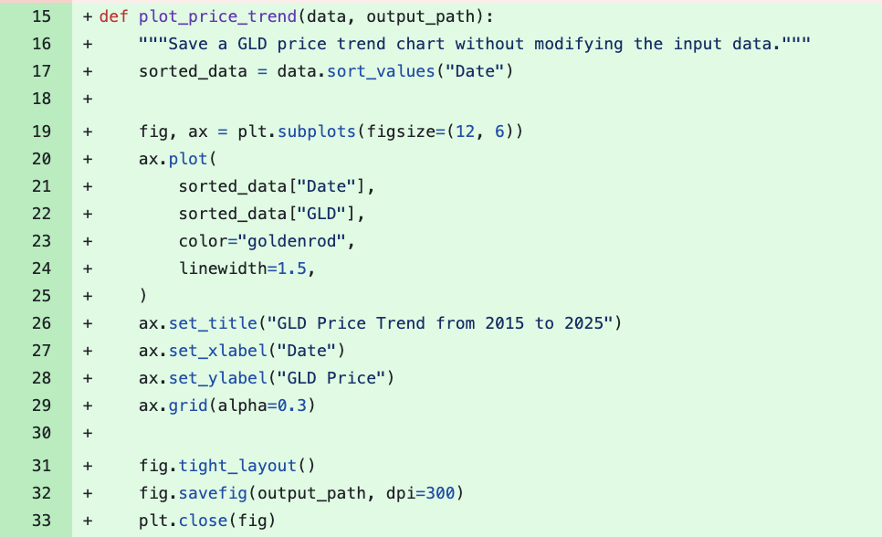
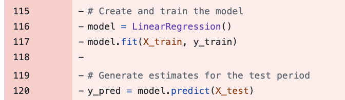
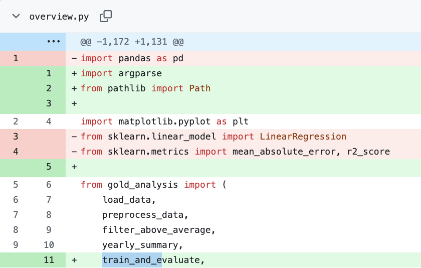

# Gold Market Data Analysis

[](https://github.com/chen04301121-cmyk/IDS706-Assignment-2/actions/workflows/tests.yml)

## Project Overview

This project explores GLD market prices from 2015 to 2025 using Python and Pandas. The analysis includes data inspection, filtering, grouping, visualization, and an introductory linear regression model.

The model examines whether SPX, USO, SLV, and EUR/USD can help explain GLD prices.

## Dataset

The dataset was obtained from Kaggle:

[Gold Price 2015–2025 Dataset](https://www.kaggle.com/datasets/mdanwarhossain200110/gold-price-2015-2025)

The dataset contains the following variables:

- `Date`: Date of the observation
- `SPX`: S&P 500 index level
- `GLD`: SPDR Gold Shares ETF price
- `USO`: United States Oil Fund price
- `SLV`: iShares Silver Trust price
- `EUR/USD`: Euro-to-U.S.-dollar exchange rate

## Tools and Libraries

- Python
- Pandas
- Matplotlib
- Scikit-learn
- Polars

## Analysis Steps

### 1. Data Inspection

The dataset was imported using Pandas. I examined:

- The first five rows
- Dataset dimensions
- Column names and data types
- Summary statistics
- Missing values
- Duplicate rows

The dataset contained no missing values and no duplicate rows.

### 2. Filtering

I calculated the overall average GLD price and filtered the dataset to retain observations where GLD was above this average.

The overall average GLD price was approximately `$158.60`. There were `1,299` trading-day observations where GLD was above the overall average.

### 3. Grouping

The data was grouped by year to calculate:

- Average GLD price
- Minimum GLD price
- Maximum GLD price
- Number of observations

Complete years generally contained approximately 249–253 trading-day observations. The year 2025 contained only 153 observations, indicating that it was a partial year in this dataset.

The annual average GLD price increased from approximately `$111.15` in 2015 to `$288.87` in the available portion of 2025.

### 4. Visualization

A line chart was created to show the GLD price trend from 2015 to 2025.



The chart shows an overall upward trend, with especially strong growth during 2024 and 2025.

### 5. Machine Learning

I used a linear regression model with the following inputs:

- SPX
- USO
- SLV
- EUR/USD

The output variable was GLD.

Because the observations are time ordered, the first 80% of the dataset was used for training and the last 20% was used for testing. The data was not randomly shuffled.

The model produced the following test results:

- Mean Absolute Error: `31.27`
- R-squared: `0.10`

The Mean Absolute Error indicates that the model's GLD estimates differed from the actual GLD values by approximately `$31.27` on average.

The R-squared value indicates that the model explained approximately 10% of the variation in GLD prices during the test period. Therefore, the selected variables had limited explanatory ability in this simple linear model.



## Additional Analysis: Daily Price Returns

The original analysis examines price levels, which may share long-term trends. This extension investigates whether GLD, SPX, USO, and SLV also move together between consecutive trading observations.

Price returns are calculated as:

```text
Return = (Current price / Previous price) - 1
```

Observations are sorted by date before calculation. The first observation is excluded because it has no preceding price. These are price-change returns; dividends are not separately incorporated.



The Pearson correlations with GLD are:

| Variable | Correlation with GLD |
|----------|---------------------|
| SLV | 0.761 |
| USO | 0.089 |
| SPX | 0.046 |

GLD and SLV show a strong positive association in their daily price changes. GLD has much weaker linear associations with SPX and USO over the full sample.

These results describe contemporaneous relationships, not causation or forecasting performance. Full-period correlations can also conceal changes across market conditions.

The script exports `daily_returns.csv` and `daily_return_correlations.csv`, allowing the calculations behind the chart to be inspected.

## Main Findings

- GLD displayed an overall upward trend between 2015 and 2025.
- GLD prices rose particularly rapidly during 2024 and 2025.
- There were 1,299 observations above the full-period average GLD price.
- The 2025 data represented only part of the year.
- The linear regression model had limited performance on the later test period.
- Relationships between financial-market variables and GLD may be nonlinear or may change over time.

## Limitations

This model uses variables observed on the same trading day, so it estimates or explains contemporaneous GLD prices rather than forecasting future prices.

The regression uses price levels, which may contain long-term trends. The additional daily return analysis examines short-term co-movement but does not establish causation or predictive ability. Future work could examine rolling correlations, volatility, lagged variables, and nonlinear models.

## How to Run the Project

Install the required libraries:

```bash
python -m pip install -r requirements.txt
```

Run the analysis:

```bash
python3 overview.py --output-dir outputs
```
The command saves three charts and two CSV files to the outputs directory.

## Files

- `overview.py`: Python data analysis script
- `gold_data_2015_25.csv`: Dataset
- `gld_price_trend.png`: GLD time-series visualization
- `actual_vs_estimated_gld.png`: Model comparison visualization
- `README.md`: Project documentation
- `polars_comparison.py`: Pandas and Polars performance comparison

## Rust Ownership Experiment

I completed and modified the provided Rust Jupyter notebook using the
Evcxr Rust kernel.

The exercises included:

- Variables and formatted output
- Conditional statements
- Loops and counting
- Mutable variables using `mut`
- Rust ownership and value movement
- Copying owned data using `.clone()`

One ownership experiment removed `.clone()` from a vector assignment.
This moved ownership of the vector to the new variable, so the original
variable could no longer be used.

Restoring `.clone()` created a separate copy, allowing both variables
to remain valid.

The completed notebook is available in:

`rust_vs_python_intro_modified.ipynb`

## Pandas and Polars Comparison

I used both Pandas and Polars to perform the same operations:

- Read the CSV file
- Convert the date column
- Filter GLD observations above the overall average
- Group GLD prices by year
- Calculate summary statistics

Both implementations identified 1,299 observations where GLD was above
its overall average, confirming that they produced consistent results.

I repeated the operations 100 times. The results were:

- Pandas total time: 0.3972 seconds
- Polars total time: 0.1460 seconds
- Pandas average per run: 0.003972 seconds
- Polars average per run: 0.001460 seconds
- Polars was approximately 2.72 times faster in this test

The dataset contains only 2,666 rows, so this result should be interpreted
cautiously. Performance on a small dataset may be affected by file caching,
startup costs, computer workload, and normal timing variation.

## Testing and Continuous Integration

The project uses Python 3.12 and pytest. All 23 test cases passed locally after the refactoring and daily return analysis were added.

### Test Coverage

- CSV loading and required-column validation.
- Data conversion, chronological sorting, duplicate removal, and invalid-data handling.
- Above-average filtering and yearly summary statistics.
- Model predictions on a dataset with a known linear relationship.
- Chronological training/test splitting and preservation of input data.
- Invalid split ratios and insufficient training or test observations.
- Daily return calculations using known percentage changes.
- Insufficient observations and missing, infinite, zero, or negative prices.
- An end-to-end run checking the original model metrics, three readable non-blank charts, and two CSV outputs.
- Agreement between exported correlations and correlations recalculated from the exported returns.

### Run Checks Locally

Install dependencies:

```bash
python3 -m pip install -r requirements-dev.txt
```

Check formatting and code quality:

```bash
python3 -m black --check overview.py gold_analysis.py polars_comparison.py tests
python3 -m flake8 overview.py gold_analysis.py polars_comparison.py tests
```

Run tests:

```bash
python3 -m pytest -v
```

### GitHub Actions

The workflow in `.github/workflows/tests.yml` runs automatically on pushes and pull requests and also supports manual execution. It installs development dependencies, checks formatting with Black, runs flake8, and executes pytest.

The CI status badge at the top of this README links to workflow results.


## Docker

The project can run inside a Docker container with Python 3.12 and its required dependencies. Matplotlib uses the non-interactive `Agg` backend to generate charts without opening windows.

### Build the Image

Run from the project root:

```bash
docker build -t gold-analysis:latest .
```

### Run the Analysis

The following commands work in macOS or Linux shells:

```bash
mkdir -p outputs/docker
docker run --rm \
  -v "$(pwd)/outputs/docker:/app/outputs" \
  gold-analysis:latest
```

The volume mount saves generated charts to the local `outputs/docker` directory:

- `gld_price_trend.png`
- `actual_vs_estimated_gld.png`
- `daily_return_correlations.png`
- `daily_returns.csv`
- `daily_return_correlations.csv`

The container exits after the analysis finishes. The `--rm` option removes the container afterward, while the charts remain in the local output directory.

### Verification and Learning

I rebuilt the image after adding the daily return analysis and ran a named container, `gold-analysis-updated-check`. Its status was `Exited (0)`, indicating successful completion. Three charts and two CSV files were saved to the mounted directory, `outputs/docker-updated`, on my Mac.

I practiced pulling a base image, building and running a project image, listing images with `docker images`, and checking container status with `docker ps -a`. I learned how a volume mount preserves analysis outputs outside the container.

### Docker Evidence







## Data Cleaning and Outlier Policy

The input dataset contains 2,666 observations. Initial inspection found no missing values or duplicate rows.

The preprocessing function:

- Checks required columns when loading the CSV.
- Converts dates and numeric fields, treating invalid values as missing.
- Removes rows with missing values in required columns.
- Removes duplicate rows and sorts observations chronologically.
- Raises an error if no valid observations remain.

Daily return calculation additionally rejects missing, infinite, zero, or negative prices and requires at least two observations.

The analysis does not automatically remove extreme but valid price observations or returns. Large changes may contain relevant market information, so magnitude alone is not used as a deletion criterion. However, individual extreme observations have not been independently verified against the original market data, and this remains a limitation. The reported correlations use the retained observations without trimming or winsorization.

The 2025 sample contains only 153 observations and should not be treated as a complete calendar year.

## Refactoring and Code Quality

The analysis was reorganized to separate reusable calculations, visualization, and script execution.

- Model training and evaluation were extracted into `train_and_evaluate()` in `gold_analysis.py`.
- Plotting was separated into dedicated functions.
- A `main()` function and an execution guard prevent the analysis from running automatically when the module is imported.
- Command-line arguments configure the input CSV and output directory.
- Figures are saved and closed, supporting automated and containerized execution.
- Black standardizes formatting, and flake8 checks Python code.

These changes make individual calculations easier to test and allow the same analysis to run locally or in Docker.

Verification included 23 passing local tests, preservation of the original rounded model metrics (MAE 31.27 and R² 0.10), and successful execution of the updated Docker image. The container exited with code 0 and generated three charts and two CSV files.

The earlier refactoring commit is available [here](https://github.com/chen04301121-cmyk/IDS706-Assignment-2/commit/00940fe).

### Refactoring Evidence

The following screenshots show the extraction of plotting logic, removal of inline model training, and import of the reusable model function.





